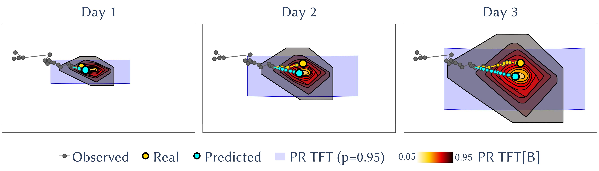
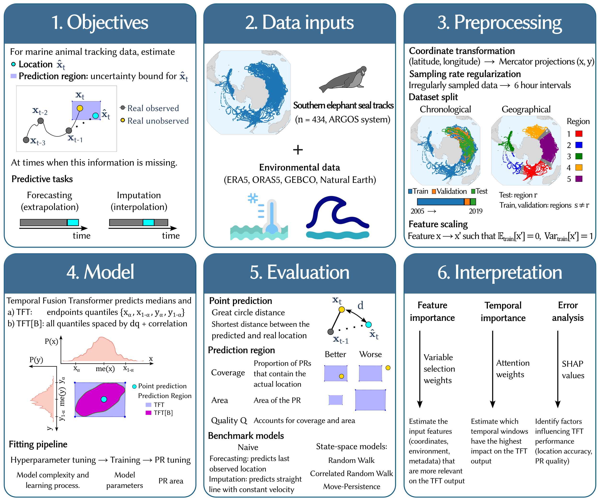

# Improving Prediction Region Accuracy in Marine Animal Movement with Temporal Fusion Transformer

[](https://www.nature.com/articles/s41598-025-29520-2)

<p align="center">
  
</p>


### Abstract

<p align="center">
  
  </p>

> Predicting marine animal movements from satellite tracking data remains challenging, limiting conservation and ecosystem management efforts. To address this, we trained the Temporal Fusion Transformer (TFT) neural network on tracking data from 434 southern elephant seals to forecast locations and fill data gaps (imputation) within 7-day windows. Compared to state-space models, TFT reduced location errors by 15% and produced more efficient prediction regions, identifying where seals were likely to be found while using less area: a fivefold reduction for forecasting and 30–40% reduction for imputation. The model performed best near the continental shelf and at low-to-moderate movement speeds, with bathymetry, water temperature and current direction being the most influential environmental factors affecting the model output. When applied to new geographic regions not represented in the training dataset, model performance declined by approximately 30% across most evaluation metrics, indicating challenges in transferring learned patterns to unfamiliar environments. Our findings show that deep learning is a promising tool for analyzing large, sparse tracking datasets. The enhanced predictive capabilities have potential for dynamic conservation measures, such as forecasting the spatial evolution of animals to minimize conflicts with human activities and environmental disturbances.


## Getting Started

Replace `dataset.csv` and `metadata.csv` under the `data` directory with your specific data.

### dataset.csv

Contains the time series for each animal. The required columns are:

- `LATITUDE`: The latitude coordinate of the animal's position in degrees.
- `LONGITUDE`: The longitude coordinate of the animal's position in degrees.
- `DATE_TIME`: The date and time of the recorded position in standard format (YYYY-MM-DD HH:MM:SS).
- `ID`: A unique identifier for the time series corresponding to each animal.

#### Format of `dataset.csv`

```plaintext
LATITUDE, LONGITUDE, DATE_TIME, ID
-34.9285, 138.6007, 2020-01-01 12:00:00, A123
-33.8688, 138.8093, 2020-01-01 13:00:00, A123
...
```

### metadata.csv

Contains static information about each animal. The required columns are:

- `ID`: The unique identifier corresponding to each animal (matching `ID` in `dataset.csv`).
- `Species`: The species of the animal.

Other static data (e.g. `Weight`, `Sex`, etc.) can be passed to the model by through the `static_categoricals` and `static_reals` arguments.

#### Format of `metadata.csv`

```plaintext
ID, Species, Sex
A123, Southern elephant seal, M
B456, Southern elephant seal, F
...
```

## Usage

Run the scripts under the `forecasting/scripts` directory for time-demanding computations. Use the `forecast.ipynb` notebook for interactive computation and plotting. To download complementary environmental variables from the [Copernicus ERA5 dataset](https://cds.climate.copernicus.eu/doi/10.24381/cds.adbb2d47) adjust the scripts within `ERA5-Land-data-analysis-main`.

## Installation

Clone the conda environment

```bash
conda env create -f environment.yml
```
and activate it

```bash
conda activate animaltorch
```

## Citation

If you found this repository useful, please cite the following.

```bibtex
@article{MedinaHernandez2025,
  title   = {Improving prediction region accuracy in marine animal movement with temporal fusion transformer},
  author  = {Medina Hern{\'a}ndez, Jorge and Rodr{\'i}guez, Jorge P. and McMahon, Clive R. and Sequeira, Ana M. M. and Egu{\'\i}luz, V{\'\i}ctor M.},
  journal = {Scientific Reports},
  year    = {2025},
  month   = dec,
  volume  = {16},
  number  = {297},
  doi     = {10.1038/s41598-025-29520-2},
  url     = {https://doi.org/10.1038/s41598-025-29520-2}
}
```

**Plain text citation:**

Medina Hernández, J., Rodríguez, J. P., McMahon, C. R., Sequeira, A. M. M., & Eguíluz, V. M. (2025). Improving prediction region accuracy in marine animal movement with temporal fusion transformer. *Scientific Reports*, *16*(297). https://doi.org/10.1038/s41598-025-29520-2
